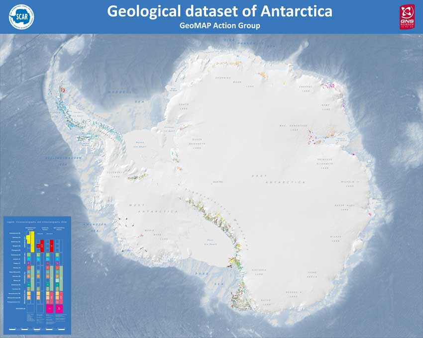

# Welcome to the source code for the Unofficial Documentation of the [SCAR GeoMAP project](https://www.scar.org/science/geomap/about/)

## Helpful links:
### If you are looking for the actual documentation, [here is the homepage](). **This link doesn't work yet.**
### **Data:** If you are looking to download the data, click [here](https://data.gns.cri.nz/ata_geomap/index.html?content=/mapservice/Content/antarctica/Download.html)

### **Problems:** If you want to report a problem with the documentation (incorrect information, broken links, etc), please create an [issue](https://github.com/selkind/GeoMap/issues) with as much detail as possible.

### **Future work:** You can find the roadmap for development of the documentation [here](https://github.com/selkind/GeoMap/projects/2). If you'd like to get involved, feel free to fork the repository and create a pull request!