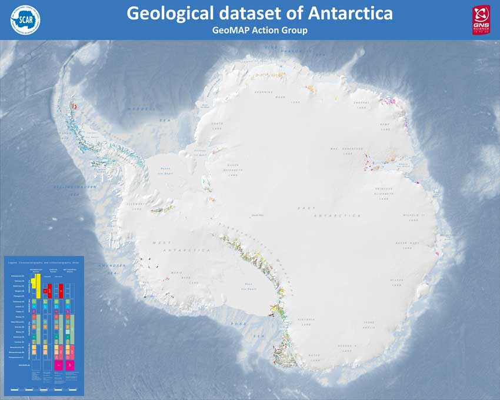

# The [SCAR GeoMAP project](https://www.scar.org/science/geomap/home/)
## Unofficial Documentation

### Cox S.C., Smith Lyttle B. and the GeoMAP team (2019). Lower Hutt, New Zealand. GNS Science. Release v.201907.
**[doi:10.21420/7SH7-6K05](https://doi.org/10.21420/7SH7-6K05)**

### Documentation created by Sam Elkind

## Links to GeoMAP resources
- **[SCAR GeoMAP Action Group homepage](https://www.scar.org/science/geomap/geomap/)**
- **[Antarctic Explorer](https://data.gns.cri.nz/ata_geomap/index.html?content=/mapservice/Content/antarctica/www/index.html)**

- **[View a Map of the Data Here](https://data.gns.cri.nz/ata_geomap/index.html?map=Antarctic)**

- **[Download the Data Here](https://data.gns.cri.nz/ata_geomap/index.html?content=/mapservice/Content/antarctica/Download.html)**

- **[GeoMAP Metadata](https://data.gns.cri.nz/metadata/srv/eng/catalog.search;jsessionid=1B49B5BC1994791F3BE4D1E54ED6DC3C#/metadata/8F618105-672A-4B89-A505-F6B195EB1858)**

- **[GeoSciML](http://geosciml.org/)**
- **[QMAP GIS Specifications](https://www.gns.cri.nz/static/datadict/)**

## Documentation Pages
- ATA_geological_units: **[Geology attributes glossary](field_glossary.md)**
- ATA_sources_poly: **Coming Soon**
- ATA_faults: **Coming Soon**
- ATA_GeoMAP_qualityinformation: **Coming Soon**

## Source Code
- These pages open source. You can find the content source and build scripts [in this Github repository](https://github.com/selkind/GeoMap)
- To report a problem with the documentation or contact Sam, please [open up an issue on github](https://github.com/selkind/GeoMap/issues) or send an email to samuel.elkind@gmail.com