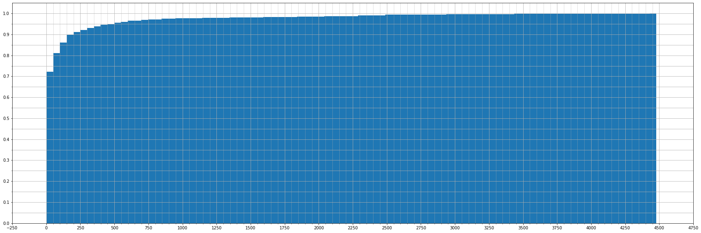
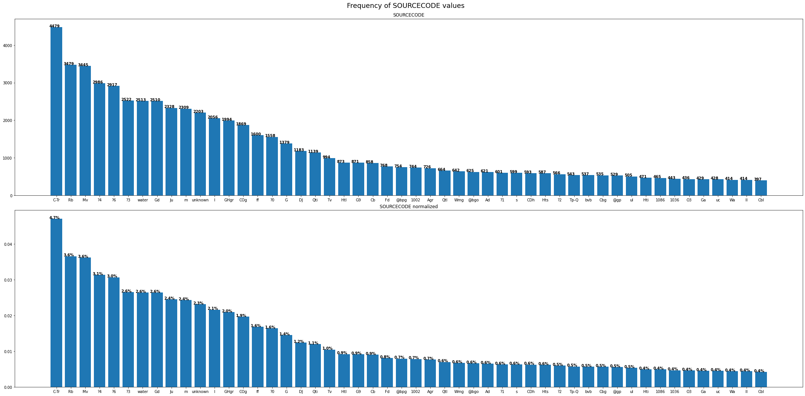
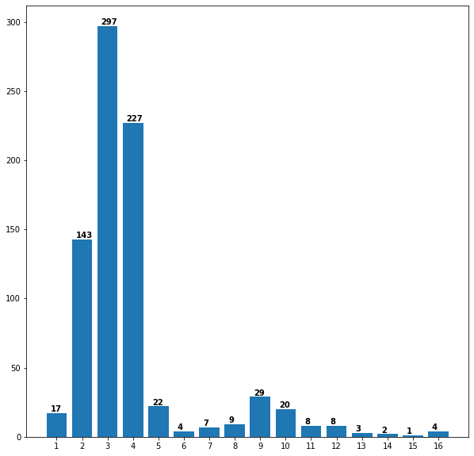
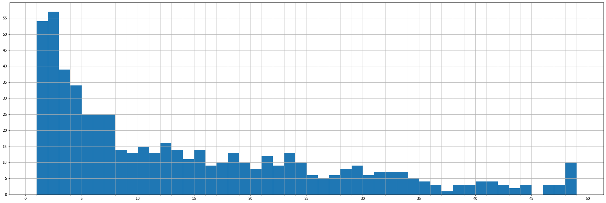

# This Notebook explores the SCAR GeoMAP dataset released in 2019
## Cox S.C., Smith Lyttle B. and the GeoMAP team (2019). Lower Hutt, New Zealand. GNS Science. Release v.201907.
### [Data Available Here](https://data.gns.cri.nz/ata_geomap/index.html?content=/mapservice/Content/antarctica/www/index.html)

### Notebook by Sam Elkind

### Configure packages, paths, and load data


```python
import os
import geopandas as gpd
import pandas as pd
import numpy as np
import matplotlib.pyplot as plt
from IPython.display import display
import pprint as pp
from tabulate import tabulate
```


```python
def plot_value_counts(field_name, values_to_plot, counts, counts_norm):
    fig, ax = plt.subplots(2, 1, figsize=(30,15))
    fig.tight_layout(pad=2.0)
    fig.subplots_adjust(top=.94)
    fig.suptitle(f"Frequency of {field_name} values", size=18)

    ax[0].set_title(field_name)
    ax[1].set_title(f"{field_name} normalized")
    for i, v in enumerate(counts[:values_to_plot]):
        ax[0].text(i - .5, v, str(v), color='black', fontweight='bold')
    for i, v in enumerate(counts_norm[:values_to_plot]):
        ax[1].text(i - .5, v, f"{str(v * 100)[:3]}%", color='black', fontweight='bold')
    ax[0].bar(counts.index[:values_to_plot], counts[:values_to_plot])
    ax[1].bar(counts_norm.index[:values_to_plot], counts_norm[:values_to_plot])
```


```python
geol_path = f"{os.getcwd()}/data/ATA_SCAR_GeoMAP_geology.gdb"
print(geol_path)
```

    /home/gt/geomap/data/ATA_SCAR_GeoMAP_geology.gdb


```python
data = gpd.read_file(geol_path)
```

# Let's investigate SOURCECODE values


```python
counts = data["SOURCECODE"].value_counts(ascending=False)
norm_counts = data["SOURCECODE"].value_counts(ascending=False, normalize=True)
```


```python
print(counts.max)
```

    <bound method Series.max of C-Tr          4479
    Rb            3479
    Mv            3445
    ?4            2986
    ?6            2917
                  ... 
    Hv_HaC14a        1
    1008             1
    Pb_Kip14a        1
    mlu              1
    Pb_Hart97b       1
    Name: SOURCECODE, Length: 801, dtype: int64>


## There are too many unique values to cleanly display in a list or a graph. Let's look at a histogram of the whole set of unique values and then look at the top end and bottom end.

### Let's begin with a cumulative frequency plot that shows the distribution of source code frequencies


```python
fig, ax = plt.subplots(1,1, figsize=(30, 10))

counts_hist = counts.hist(cumulative=True, density=1, bins=90, ax=ax, histtype="bar")
minor_x_ticks = np.arange(0, 4500, 50)
major_x_ticks = np.arange(-250, 5000, 250)
ax.set_xticks(major_x_ticks, minor=False)
ax.set_xticks(minor_x_ticks, minor=True)
ax.xaxis.grid(True, which='minor', alpha=0.5)

major_y_ticks = np.arange(0, 1.1, 0.1)
minor_y_ticks = np.arange(0, 1, 0.05)
ax.set_yticks(major_y_ticks, minor=False)
ax.set_yticks(minor_y_ticks, minor=True)
ax.yaxis.grid(True, which='minor')
```


    

    


#### The range of code frequencies is roughly {1, 4500}, thus with 90 bins we get bins with that represent roughly 50 values each.
- over 70% of source codes have 50 or fewer occurrences. It may be interesting to look at a cumulative frequency plot or histogram of just that bin.
- over 80% of source codes have 100 or fewer occurrences. 
- 90% of source codes have 200 or fewer occurences. Above 200 occurrences, the frequency of codes drops off exponentially.
- Because of this exponential drop in code frequency towards the upper end, plotting that end of the distribution in a bar graph may yield some interpretable information

### What does a bar graph tells us about the top 50 most frequently occurring values?


```python
plot_value_counts("SOURCECODE", 50, counts, norm_counts)
```


    

    


#### Discusion of frequently occuring codes:
- Unknown observations jump out as the 11th most frequently occuring code. 
- There are several frequently occurring codes that are simply 2-digit numbers. It may be the case that these numbers are displayed on the map, but are codes for legend entries in the source that have a alphabetic code for the rock unit. Including or converting to these alphabetic codes from the source may be out of scope for the SOURCECODE field. Need to look up the description of this field for clarification.
- If I want to dive down a rabbit hole I could try to group the codes by format (2-letter codes, 3-letter codes, 2-digit numbers, codes with "@" prefix, etc) and see if there are correlations with the source or the background of the source creator.


### Since "unknown" is a string, let's see if there were other values that are just typos or abbreviations of "unknown" in this set of values.


```python
print("number of 'unkown' polys:", counts["unknown"])
unknown_alts = [i for i in counts.index if "un" in i.lower()] 
print("Unknown alternatives:")
for i in unknown_alts:
    print(f"SOURCECODE: {i}, polygons: {counts[i]}")
```

    number of 'unkown' polys: 2203
    Unknown alternatives:
    SOURCECODE: unknown, polygons: 2203
    SOURCECODE: unk, polygons: 111


There's one other source code appearing that is literally "unk". It might be useful to look at the sources of these to see if the code is shorthand for unknown and should be corrected, or is actually a mapped unit.

#### Following up on unknowns, the question mark was used to indicate uncertainty in the classification. There are 38 SOURCECODES with question marks and these represent nearly 12,000 polygons


```python
question_marks = [i for i in counts.index if "?" in i]
print(f"SOURCECODEs with '?' ({counts[question_marks].sum()} in total)")
print()
for i in question_marks:
    print(f"SOURCECODE: {i}, polygons: {counts[i]}")
```

    SOURCECODEs with '?' (11941 in total)
    
    SOURCECODE: ?4, polygons: 2986
    SOURCECODE: ?6, polygons: 2917
    SOURCECODE: ?3, polygons: 2522
    SOURCECODE: ?0, polygons: 1558
    SOURCECODE: ?1, polygons: 601
    SOURCECODE: ?2, polygons: 566
    SOURCECODE: ?5, polygons: 339
    SOURCECODE: g?, polygons: 63
    SOURCECODE: ff?, polygons: 61
    SOURCECODE: Mv?, polygons: 47
    SOURCECODE: ?, polygons: 38
    SOURCECODE: mv?, polygons: 29
    SOURCECODE: ut?, polygons: 28
    SOURCECODE: Cb?, polygons: 28
    SOURCECODE: ?7, polygons: 24
    SOURCECODE: bt?, polygons: 17
    SOURCECODE: mvb?, polygons: 15
    SOURCECODE: ul?, polygons: 12
    SOURCECODE: grb?, polygons: 11
    SOURCECODE: s?, polygons: 10
    SOURCECODE: gam?, polygons: 9
    SOURCECODE: fm?, polygons: 7
    SOURCECODE: gaa?, polygons: 7
    SOURCECODE: gg?, polygons: 7
    SOURCECODE: Pb_LeM2c1?, polygons: 6
    SOURCECODE: sm?, polygons: 5
    SOURCECODE: PP?, polygons: 5
    SOURCECODE: bv?, polygons: 4
    SOURCECODE: gr?, polygons: 3
    SOURCECODE: PC-B?, polygons: 3
    SOURCECODE: I?, polygons: 2
    SOURCECODE: fc?, polygons: 2
    SOURCECODE: gro?, polygons: 2
    SOURCECODE: uc?, polygons: 2
    SOURCECODE: btb?, polygons: 2
    SOURCECODE: uk?, polygons: 1
    SOURCECODE: ss?, polygons: 1
    SOURCECODE: uir3?, polygons: 1


Reflecting on all of this, while "unkown", "unk", and "?" all indicate an unknown rock classification, correcting these would to a single code would conflict with the intent behind the SOURCECODE field. It will be important, however, to ensure that polygons with these three SOURCECODES have consistent attribution in other lithologically-oriented fields

## Switching gears, Let's take a quick look at the formatting of symbols. For starters, let's look at the distributions of SOURCE CODE lengths


```python
src_code_lengths = pd.DataFrame([int(len(i)) for i in counts.index]).value_counts(ascending=False)
```


```python
indices = [int(i[0]) for i in src_code_lengths.index]
values = [i for i in src_code_lengths]
sorted_lengths = sorted(list(zip(indices, values)))
```


```python
sorted_indices, sorted_values = list(zip(*sorted_lengths))
```


```python
fig, ax = plt.subplots(1,1, figsize=(10, 10))
x_ticks = np.arange(1, 17, 1)
ax.set_xticks(x_ticks, minor=False)
for i, v in enumerate(sorted_values):
    ax.text(i + .75, v + 1, str(v), color='black', fontweight='bold')
ax.bar(sorted_indices, sorted_values)
print(f"{sum(sorted_values[4:])} values longer than 4 characters")
```

    117 values longer than 4 characters


    

    


The vast majority of codes have lengths between 2 and 4 characters. However, a significant number of codes have lengths longer than 5 characters. Let's take a closer look at these.


```python
med_length_vals = [i for i in counts.index if len(i) > 4]
print(f"codes with more than 4 chars: {len(med_length_vals)} ({len(med_length_vals) / counts.shape[0] * 100:.2f}% of codes)")
print(f"number of polys represented by these SOURCECODES: {counts[med_length_vals].sum()} ({counts[med_length_vals].sum() / counts.sum() * 100:.2f}% of polygons)")
print()
print("displaying source codes longer than 10 chars:")
long_values = [i for i in counts.index if len(i) > 10]
pp.pp(long_values)
print("number of polys represented by these SOURCECODES:", counts[long_values].sum())
```

    codes with more than 4 chars: 117 (14.61% of codes)
    number of polys represented by these SOURCECODES: 7003 (7.36% of polygons)
    
    displaying source codes longer than 10 chars:
    ['MP2-3//NP11bv1',
     'MP3-NP1//NP12pr2',
     'MP3-NP1//NP12pr1',
     'Pb_LMB12.3c',
     'MP1-2//NP1fl',
     'MP2-3//NP11bv2',
     'MP3-NP1//Egr2',
     'MP2-3//NP11bv',
     'Pb_LMB14.2b',
     'MP3-NP1//Egr1',
     'Pb_LMB12.3b',
     'Pb_LMB14.2d',
     'Pb_LMB16D.1a',
     'PP-MP1//NP11',
     'Pb_LMB16B.3a',
     'Pb_LMB12.3a',
     'Pb_LMB14.2c',
     'Pb_LMB16D.1_ins',
     'Pb_LMB16A.1a',
     'Pb_LMB14.2a',
     'Pb_LMB16D.1b',
     'MP3-NP1//NP12sc2',
     'Pb_LMB16D.1d',
     'Pb_LMB14.2e',
     'Pb_LMB16D.1c',
     'MP3-NP1//NP12sc1']
    number of polys represented by these SOURCECODES: 642


There are 26 codes longer than 10 characters. Inspecting these, the notation they follow  appear (to me) to be sample ids from a study (this will have to be cross checked by looking at the sources). If this is the case, these polys would probably be better labeled with a more generic SOURCECODE.

## What can we learn from looking at the least-represented SOURCECODES?

### As we established above, over 70% of SOURCECODES represent less than 50 polygons each.
#### Let's make a histogram of just this subset.


```python
less_than_50 = counts[counts < 50]
```


```python
print(less_than_50.max())
print(less_than_50.min())
```

    49
    1


```python
fig, ax = plt.subplots(1,1, figsize=(30, 10))

less_than_50_hist = less_than_50.hist(bins=48, ax=ax, histtype="bar")
minor_x_ticks = np.arange(0, less_than_50.max() + 1, 1)
major_x_ticks = np.arange(0, less_than_50.max() + 5, 5)
ax.set_xticks(major_x_ticks, minor=False)
ax.set_xticks(minor_x_ticks, minor=True)
ax.xaxis.grid(True, which='minor', alpha=0.5)

major_y_ticks = np.arange(0, 60, 5)
ax.set_yticks(major_y_ticks)
```


    [<matplotlib.axis.YTick at 0x7f09ad38cc10>,
     <matplotlib.axis.YTick at 0x7f09ad38c7f0>,
     <matplotlib.axis.YTick at 0x7f09ad38a580>,
     <matplotlib.axis.YTick at 0x7f09ad323b20>,
     <matplotlib.axis.YTick at 0x7f09ad2a7070>,
     <matplotlib.axis.YTick at 0x7f09ad2a7580>,
     <matplotlib.axis.YTick at 0x7f09ad2a7a90>,
     <matplotlib.axis.YTick at 0x7f09ad323850>,
     <matplotlib.axis.YTick at 0x7f09ad31a4f0>,
     <matplotlib.axis.YTick at 0x7f09ad2a7790>,
     <matplotlib.axis.YTick at 0x7f09ad2a8190>,
     <matplotlib.axis.YTick at 0x7f09ad2a86a0>]


    

    


#### Not a whole lot to see here. It's intuitive that there should be more source codes for polygons that occur less than 5 times. 

How many codes are only applied to a single polygon? 


```python
single_codes = pd.DataFrame(counts[counts <= 1])
print("single codes: ", single_codes.shape[0])
```

    single codes:  54


#### Only 54 codes with a single polygon. That's pretty good.

#### Let's check for potential capitalization errors


```python
lower_codes = [i.lower() for i in counts.index]
```


```python
print(len(lower_codes))
lower_codes_distinct = set(lower_codes)
print(len(lower_codes_distinct))
cap_error_candidates = pd.DataFrame(lower_codes).value_counts()
print(cap_error_candidates[cap_error_candidates > 1])
```

    801
    793
    qm     2
    g      2
    bv     2
    mv?    2
    mv     2
    pcs    2
    ocg    2
    pp     2
    dtype: int64


8 values that are only differentiated by capitalization is great. When they do occur, there is only one variation. This is a small enough set to check sources for these codes to verify whether either or both are correct.
