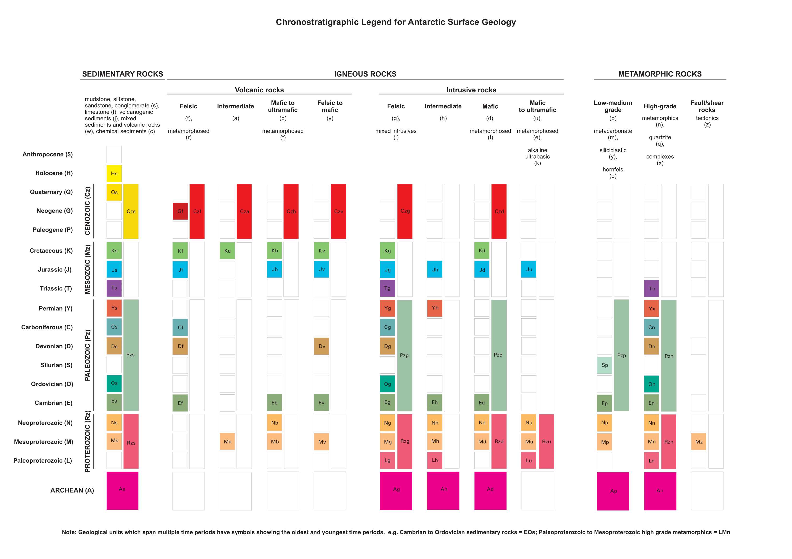

## Ages and Age codes

### ARCHEAN (A)

### PROTEROZOIC (Rz)
- Paleoproterozoic (L)
- Mesoproterozoic (M)
- Neoproterozoic (N)

### PALEOZOIC (Pz)
- Cambrian (E)
- Ordovician (O)
- Silurian (S)
- Devonian (D)
- Carboniferous (C)
- Permian (Y)

### MESOZOIC (Mz)
- Triassic (T)
- Jurassic (J)
- Cretaceous (K)

### CENOZOIC (Cz)
- Paleogene (P)
- Neogene (G)
- Quaternary (Q)

- Holocene (H)
- Anthropocene ($)
- Uncertain (?)

## Lithologies and Lith codes

### SEDIMENTARY ROCKS: 
- mudstone, siltstone, sandstone, conglomerate (s), limestone (l), volcanogenic sediments (j), mixed sediments and volcanic rocks (w), chemical sediments (c).

### VOLCANIC ROCKS: 
- felsic (f), metamorphosed felsic volcanics (r), intermediate (a), mafic to ultramafic (b), metamorphosed mafic to ultramafic extrusive rocks (t), undifferentiated felsic to mafic (v).

### INTRUSIVE ROCKS: 
- felsic (g), mixed intrusives (i), intermediate (h), mafic (d) metamorphosed mafic intrusive (t), metamorphosed mafic to ultramafic intrusive (e), alkaline ultrabasic (k).

### METAMORPHIC ROCKS: 
- Low-medium grade (p), metacarbonate (m), siliciclastic (y), hornfels (o); High-grade metamorphics (n), quartzite (q), complexes (x).

### OTHER: 
- Faults/shear rocks tectonic (z). Unknown (?)

