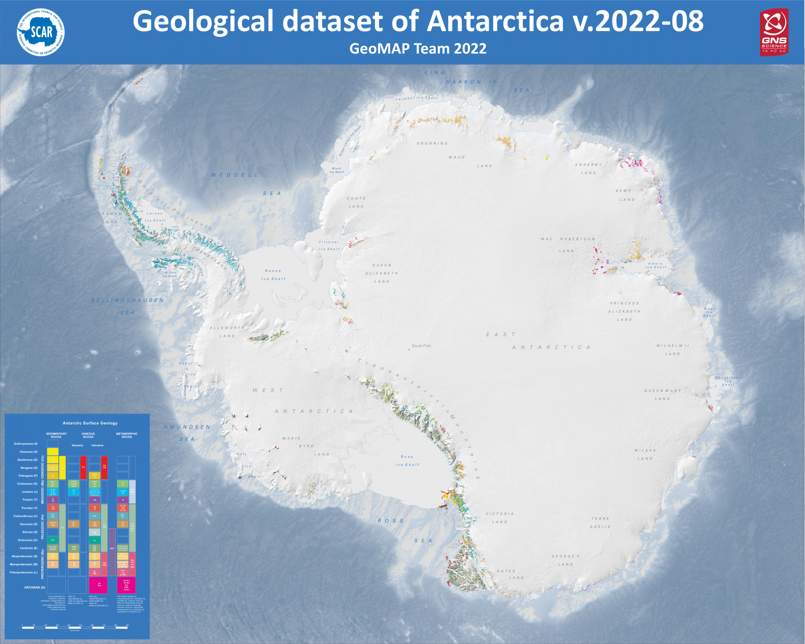

.. GeoMAP documentation master file, created by
   sphinx-quickstart on Sat Dec  5 11:50:30 2020.
   You can adapt this file completely to your liking, but it should at least
   contain the root `toctree` directive.

The `SCAR GeoMAP project <https://www.scar.org/science/geomap/home/>`_
====================================================================================================

Unofficial Documentation
#########################################################

.. toctree::
   :maxdepth: 2
   :name: main
   :caption: Table of Contents
   :hidden:
   
   index

Citation and Metadata
**************************************************************************************************************

Citation:

Cox, Simon Christopher; Smith Lyttle, Belinda; Elkind, Samuel; Smith Siddoway, Christine; Morin, Paul; Capponi, Giovanni; Abu-Alam, Tamer; Ballinger, Matilda; Bamber, Lauren; Kitchener, Brett; Lelli, Luigi; Mawson, Jasmine F; Millikin, Alexie; Dal Seno, Nicola; Whitburn, Louis; White, Tristan; Burton-Johnson, Alex; Crispini, Laura; Elliot, David; Elvevold, Synnove; Goodge, John W; Halpin, Jacqueline A; Jacobs, Joachim; Mikhalsky, Eugene; Martin, Adam P; Morgan, Fraser; Smellie, John; Scadden, Phil; Wilson, Gary (2023). Lower Hutt, New Zealand. GNS Science. Release v.2022-08.

Metadata: `doi:10.21420/7SH7-6K05 <https://doi.org/10.21420/7SH7-6K05>`_

Documentation created by Sam Elkind
*************************************

Links to GeoMAP resources
#############################
* `SCAR GeoMAP Action Group homepage <https://www.scar.org/science/geomap/geomap/>`_
* `Antarctic Explorer <https://data.gns.cri.nz/ata_geomap/index.html?content=/mapservice/Content/antarctica/www/index.html>`_
* `View a Map of the Data Here <https://data.gns.cri.nz/ata_geomap/index.html?map=Antarctic_v2022>`_
* `Download the Data Here <https://doi.org/10.1594/PANGAEA.951482>`_
* `GeoMAP Metadata <https://data.gns.cri.nz/metadata/srv/eng/catalog.search#/metadata/333C1D5A-1F80-4ED2-B6A6-52AB2B03A52F>`_
* `GeoSciML <http://geosciml.org/>`_

Documentation Pages
#############################

**ATA_GeoMAP_geological_units:**

* :doc:`Geology Field Glossary <field_glossary>`

**ATA_GeoMAP_legends:**

* :doc:`Legends <legend>`

**ATA_GeoMAP_sources:** 

* :doc:`Source Field Glossary <source_glossary>`
* :doc:`Published Papers <works_referenced/published_paper>`
* :doc:`Published Maps <works_referenced/published_map>`
* :doc:`GIS Datasets <works_referenced/gis>`
* :doc:`Theses <works_referenced/thesis>`
* :doc:`Unpublished Works <works_referenced/unpublished>`
* :doc:`Unknown Works <works_referenced/unknown>`

**ATA_GeoMAP_faults:**

* :doc:`Faults Field Glossary <faults_glossary>`

**ATA_GeoMAP_quality:**

* :doc:`Quality Field Glossary <qualinfo_glossary>`

**Restricted Value Lists:**

* :doc:`Restricted Values <restricted_values>`

.. toctree::
   :maxdepth: 3
   :caption: ATA_GeoMAP_geological_units
   :hidden:

   field_glossary

.. toctree::
   :maxdepth: 3
   :caption: ATA_GeoMAP_legends
   :hidden:

   legend

.. toctree::
   :maxdepth: 3
   :caption: ATA_GeoMAP_sources
   :hidden:

   source_glossary
   works_referenced/published_paper
   works_referenced/published_map
   works_referenced/gis
   works_referenced/thesis
   works_referenced/unpublished
   works_referenced/unknown

.. toctree::
   :maxdepth: 3
   :caption: ATA_GeoMAP_faults
   :hidden:

   faults_glossary

.. toctree::
   :maxdepth: 3
   :caption: ATA_GeoMAP_quality
   :hidden:

   qualinfo_glossary 

.. toctree::
   :maxdepth: 3
   :caption: Restricted_Values
   :hidden:

   restricted_values

Source Code
#############################
* These pages open source. You can find the content source and build scripts `in this Github repository <https://github.com/selkind/GeoMap>`_
* To report a problem with the documentation or contact Sam, please `open up an issue on github <https://github.com/selkind/GeoMap/issues>`_ or send an email to samuel.elkind@gmail.com
