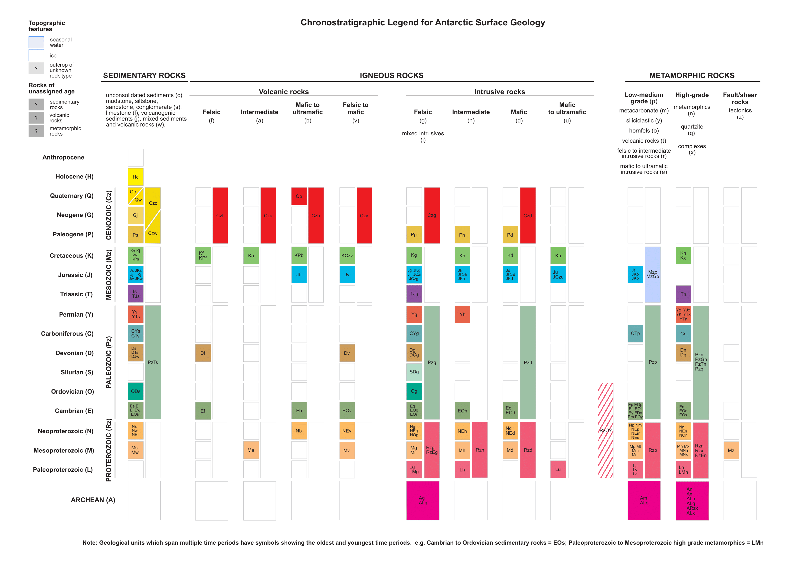

# Chronostratigraphic Legend

## Ages and Age codes

### ARCHEAN (A)

### PROTEROZOIC (Rz)
- Paleoproterozoic (L)
- Mesoproterozoic (M)
- Neoproterozoic (N)

### PALEOZOIC (Pz)
- Cambrian (E)
- Ordovician (O)
- Silurian (S)
- Devonian (D)
- Carboniferous (C)
- Permian (Y)

### MESOZOIC (Mz)
- Triassic (T)
- Jurassic (J)
- Cretaceous (K)

### CENOZOIC (Cz)
- Paleogene (P)
- Neogene (G)
- Quaternary (Q)

- Holocene (H)
- Uncertain (?)

## Lithologies and Lith codes

### SEDIMENTARY ROCKS: 
- unconsolidated sediments (c)
- mudstone, siltstone, sandstone, conglomerate (s)
- limestone (l)
- volcanogenic sediments (j)
- mixed sediments and volcanic rocks (w)

### VOLCANIC ROCKS: 
- felsic (f)
- intermediate (a)
- mafic to ultramafic (b)
- felsic to mafic (v)

### INTRUSIVE ROCKS: 
- felsic (g)
- mixed intrusives (i)
- intermediate (h)
- mafic (d)
- mafic to ultramafic (u)

### METAMORPHIC ROCKS: 
- Low-medium grade (p)
    - metacarbonate (m)
    - siliciclastic (y)
    - hornfels (o)
    - volcanic rocks (t)
    - felsic to intermediate intrusive rocks (r)
    - mafic to ultramafic (e)
- High-grade (n)
    - quartzite (q)
    - complexes (x)
- Fault/Shear rocks
  - tectonics(z)

### OTHER: 
- Unknown (?)

