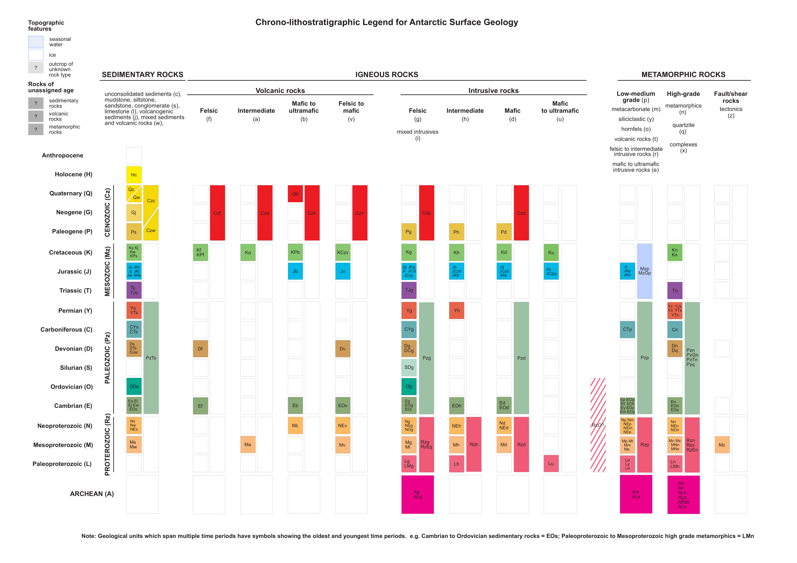
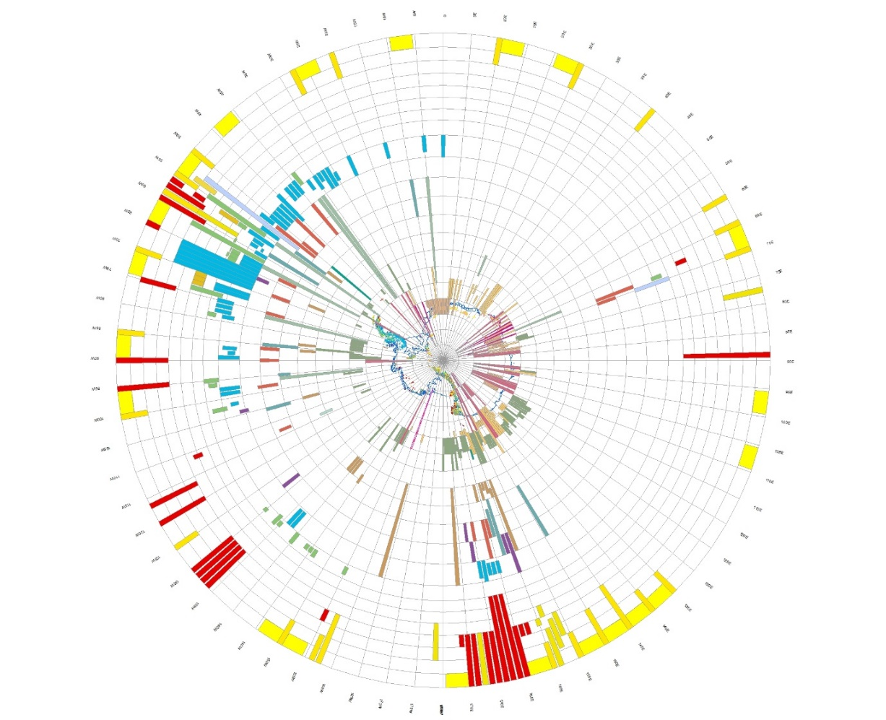
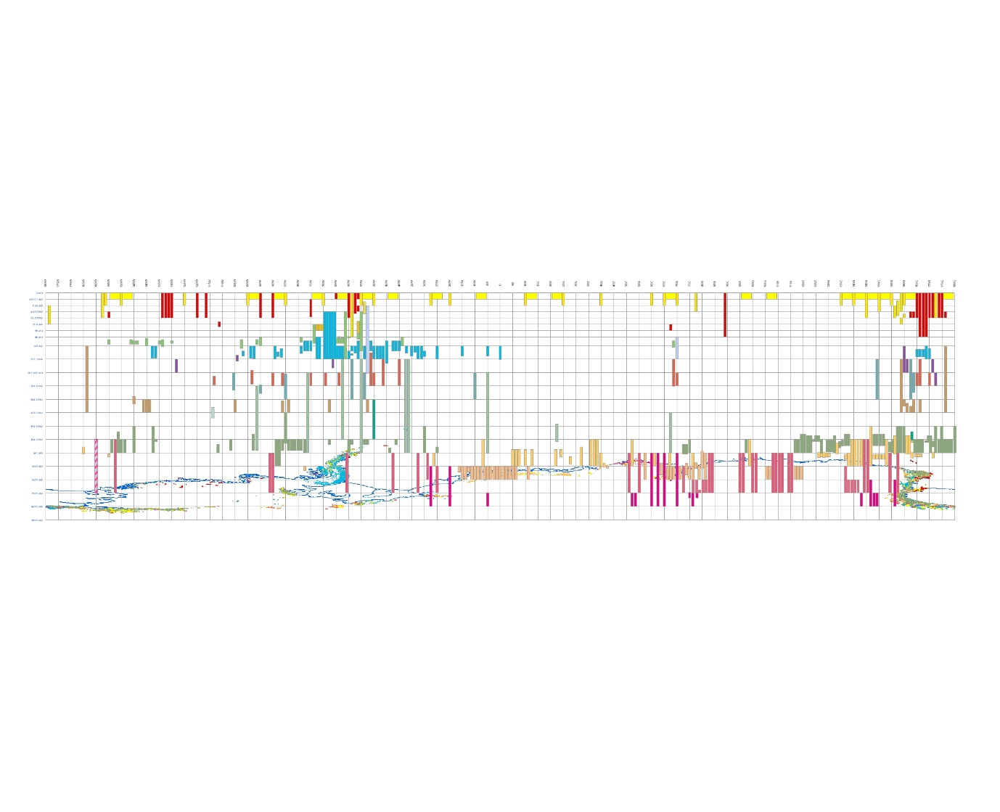

# Chrono-lithostratigraphic Legend

# Time-Space Diagram

## Antarctic Polar Stereographic

## WSG 84 Projection

A new feature of v.2022-08 is the addition of a geological legend portrayed as a time-space diagram. This vector
data layer spatially represents a geological legend depicting the exposed rock outcrop and covering sediments of
Antarctica. It illustrates the representative age and type of rock in the approximate location that the exposure
occurs. Each unit on the legend is coloured by geologic unit devised for this GeoMAP compilation but also records
the code used on the original published map or dataset in the attribute field named SOURCECODE.

As the name implies, a space-time diagram is a graph showing the position of objects as a function of time. As is the
usual convention in a geological legend, time runs up the diagram equivalent to a Y-axis, so the bottom is the past, or
early times, and the top is the future, or late times. The lines of longitude form an X-axis and provide the geographic
context to anchor the features in the legend layer.
This geological legend was constructed using EPSG:4978 (WGS 84) coordinate system, but this legend and the
associated geological layers are suitable for projection in other coordinate systems.
Popular GIS software packages, such as ArcGIS and QGIS allow a user to project geospatial layers “on the fly”. Once
the geological legend is loaded in a map project, by changing the coordinate system in the map properties, it is
possible to see the spatial context of different rock ages from a different perspective. A user might switch between
EPSG:4978 (WGS 84) or EPSG:3031 (WGS 84/Antarctic Polar Stereographic) or EPSG:3832 (WGS 84/PDC Mercator)
coordinate systems to gain an appreciation of the geological age variation around the continent.

## Ages and Age codes

### ARCHEAN (A)

### PROTEROZOIC (Rz)
- Paleoproterozoic (L)
- Mesoproterozoic (M)
- Neoproterozoic (N)

### PALEOZOIC (Pz)
- Cambrian (E)
- Ordovician (O)
- Silurian (S)
- Devonian (D)
- Carboniferous (C)
- Permian (Y)

### MESOZOIC (Mz)
- Triassic (T)
- Jurassic (J)
- Cretaceous (K)

### CENOZOIC (Cz)
- Paleogene (P)
- Neogene (G)
- Quaternary (Q)

- Holocene (H)
- Uncertain (?)

## Lithologies and Lith codes

### SEDIMENTARY ROCKS: 
- unconsolidated sediments (c)
- mudstone, siltstone, sandstone, conglomerate (s)
- limestone (l)
- volcanogenic sediments (j)
- mixed sediments and volcanic rocks (w)

### VOLCANIC ROCKS: 
- felsic (f)
- intermediate (a)
- mafic to ultramafic (b)
- felsic to mafic (v)

### INTRUSIVE ROCKS: 
- felsic (g)
- mixed intrusives (i)
- intermediate (h)
- mafic (d)
- mafic to ultramafic (u)

### METAMORPHIC ROCKS: 
- Low-medium grade (p)
    - metacarbonate (m)
    - siliciclastic (y)
    - hornfels (o)
    - volcanic rocks (t)
    - felsic to intermediate intrusive rocks (r)
    - mafic to ultramafic (e)
- High-grade (n)
    - quartzite (q)
    - complexes (x)
- Fault/Shear rocks
  - tectonics(z)

### OTHER: 
- Unknown (?)
